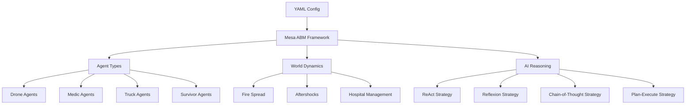

# 🚨 CrisisSim: AI-Powered Emergency Response Simulator


> **CrisisSim** is an immersive, multi-agent disaster response simulator powered by Large Language Models (LLMs) like GPT-4, Gemini, and Groq.  
> Experience real-time strategy, advanced analytics, and collaborative AI teamwork in crisis scenarios.

---

## 🏙️ What is CrisisSim?

CrisisSim enables researchers, educators, and developers to simulate complex disaster response scenarios.  
Agents (drones, medics, trucks, and survivors) operate in a dynamic world, with real-time coordination and reasoning powered by state-of-the-art LLMs.


---

## 🧩 Key Features

- **Multi-Agent AI Simulation**: Realistic disaster environments with coordinated agents.
- **LLM Reasoning Frameworks**:  
  - **ReAct**: Dynamic reasoning and acting  
  - **Reflexion**: Memory and self-improvement  
  - **Chain-of-Thought**: Step-wise logical reasoning  
  - **Plan-and-Execute**: Strategic planning
- **Live Visualization**: WebSocket-powered dashboard shows simulation in real time.
- **Deep Analytics**: Track performance, resource usage, decision quality.
- **Experiment Suite**: Automated runs, logs, CSV exports, and advanced plots.
- **Extensible Environment**: Easily add new strategies, agents, or world dynamics.

---

## 🏗️ System Architecture

High-level view of core components:


<details>
<summary>Mermaid Diagram</summary>


</details>

---

## 🚀 Quickstart

1. **Clone the repository**
    ```bash
    git clone https://github.com/tahahasan01/EmergencyResponseAI.git
    cd EmergencyResponseAI
    ```

2. **Install dependencies**
    ```bash
    pip install -r requirements.txt
    ```

3. **Set your API keys**
    ```bash
    export GROQ_API_KEY="your_groq_api_key_here"
    export GEMINI_API_KEY="your_gemini_api_key_here"
    ```

4. **Run a simulation**
    - Single experiment:
      ```bash
      python main.py --map configs/map_small.yaml --provider groq --strategy react --seed 42
      ```
    - Launch the GUI:
      ```bash
      python server.py
      # Open http://127.0.0.1:8522 in your browser
      ```
    - Batch experiments:
      ```bash
      python eval/harness.py
      ```
    - Generate performance plots:
      ```bash
      python eval/plots.py
      ```

---

## 📦 Output Structure

```
results/
├── raw/        # Per-experiment JSON
├── agg/        # Aggregated CSVs
└── plots/      # Visualizations
logs/
└── strategy=<name>/run=<id>/
    ├── tick000.jsonl
    ├── tick001.jsonl
    └── ...
```

---

## 🛠️ Customization & Extensions

- **Add a new strategy:**  
  1. Create in `reasoning/`
  2. Implement planner interface
  3. Register in `planner.py`

- **Extend the environment:**  
  1. Modify `env/dynamics.py`
  2. Integrate via `env/world.py`
  3. Track new metrics

---

## 🧪 Testing

Run the system tests:
```bash
python test_system.py
```
Checks imports, planning, environment, configs, and evaluation tools.

---

## 🔍 Troubleshooting

- **API Key missing?**  
  Set `GROQ_API_KEY` or `GEMINI_API_KEY`
- **Import errors?**  
  Run `python test_system.py`
- **LLM errors?**  
  Check logs for invalid output
- **GUI issues?**  
  Check Mesa and port 8522

**Performance tips:**  
- Lower temperature for consistent LLMs  
- Limit scratchpad/token size  
- Watch API rates

---

## 🤝 Contributing

- Follow code style
- Pass all tests (`python test_system.py`)
- Log new features
- Document new capabilities in README

---

## 📄 License

MIT. See [LICENSE](LICENSE).

---

## 💡 Inspiration & Goals

CrisisSim aims to advance research in AI teamwork, disaster response, and agent simulation.  
It’s perfect for researchers, educators, hackathons, and anyone interested in multi-agent intelligence.

---

## 🚀 Ready to save the world—one simulation at a time?

**Fork, run, and innovate with CrisisSim! 🚑🚒🚁**

---
