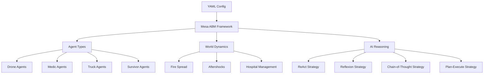

# 🚨 CrisisSim: LLM-Powered Emergency Response Simulation

[](https://python.org)
[](LICENSE)
[](https://websockets.readthedocs.io/)
[](https://openai.com)
[]()

> **Unleash the future of crisis management!  
> CrisisSim is an immersive, multi-agent disaster response simulator powered by LLMs (GPT-4, Gemini, Groq).  
> Experience real-time strategy, advanced analytics, and AI teamwork as never before.**

<div align="center">

```
╔═══════════════════════════════════════════════════════════════════════════════════╗
║                    🏙️ THE ULTIMATE EMERGENCY RESPONSE SANDBOX                   ║
╠═══════════════════════════════════════════════════════════════════════════════════╣
║ 🚑 RESCUE DRONES    🔥 RAGING FIRES    👥 TRAPPED SURVIVORS    🧱 COLLAPSING BUILDINGS ║
║                                                                                   ║
║ 🤖 LLM Agents: Compete or cooperate using ReAct, Reflexion, CoT, Plan&Execute    ║
║ ⚡ Live Simulation: WebSocket-powered instant visual feedback                     ║
║ 📊 Deep Analytics: Performance, resource use, decision quality                   ║
║ 💡 Dynamic World: Random aftershocks, spreading fires, survivor triage           ║
╚═══════════════════════════════════════════════════════════════════════════════════╝
```


</div>

---

## 🏗️ CrisisSim System Architecture

> A high-level view of how CrisisSim's components interact.


Or, view the architecture in Mermaid (renders on GitHub):



---

## 🌟 Why CrisisSim?

- **Test state-of-the-art LLM behaviors** under real-world disaster scenarios
- **Visualize agent intelligence** with instant feedback and dashboards
- **Push the boundaries** of multi-agent coordination, planning, and learning
- **Flexible, extensible, and fun**: perfect for research, teaching, or hackathons

---

## 🚀 Core Features

### 🧠 LLM Reasoning Frameworks
- **ReAct**: Dynamic reasoning + acting
- **Reflexion**: Memory & self-improvement
- **Chain-of-Thought (CoT)**: Step-wise logic
- **Plan-and-Execute**: Strategic planning

### 🌍 Smart Simulation World
- **Drones** need to recharge
- **Medics** slow down with patients
- **Trucks** must resupply
- **Fire** propagates with building vulnerability
- **Aftershocks** shake up the map
- **Hospital triage** prioritizes survivors

### 🖥️ Modern GUI
- **Live entities & resources** (battery, water, tools)
- **Color-coded stats**
- **Termination-aware charts**
- **Instant performance metrics**

### 🧪 Experiment & Analysis Suite
- **Automated batch runs**
- **Full tick-by-tick logs**
- **CSV & advanced plots**
- **Easy customization**

---

## ⚡ Quickstart

1. **Clone the repo**  
    ```bash
    git clone https://github.com/tahahasan01/EmergencyResponseAI.git
    cd EmergencyResponseAI
    ```

2. **Install dependencies**  
    ```bash
    pip install -r requirements.txt
    ```

3. **Set your API key**  
    ```bash
    export GROQ_API_KEY="your_groq_api_key_here"
    export GEMINI_API_KEY="your_gemini_api_key_here"
    ```

---

## 🎮 Simulation Controls

**Run a single experiment:**
```bash
python main.py --map configs/map_small.yaml --provider groq --strategy react --seed 42
```

**Launch the GUI:**
```bash
python server.py
# Visit: http://127.0.0.1:8522
```

**Batch experiments:**
```bash
python eval/harness.py
```

**Generate performance plots:**
```bash
python eval/plots.py
```

---

## 🔍 Output Structure

```
results/
├── raw/        # Per-experiment JSON
├── agg/        # Aggregated CSVs
└── plots/      # Visualizations
logs/
└── strategy=<name>/run=<id>/
    ├── tick000.jsonl
    ├── tick001.jsonl
    └── ...
```

---

## 🛠️ Customization

**Add a new strategy:**  
1. Create in `reasoning/`
2. Implement the planner interface
3. Register in `planner.py`

**Extend the environment:**  
1. Customize `env/dynamics.py`
2. Integrate via `env/world.py`
3. Track new metrics

---

## 🧪 Testing

```bash
python test_system.py
```
- Checks imports, planning, environment, configs, and evaluation tools

---

## 💬 Logging & Debugging

- **LLM logs:** JSONL per tick, full prompts and responses
- **Error metrics:** Invalid JSON, replans, resource failures

---

## 📚 Architecture

```
EmergencyResponseAI/
├── main.py           # CLI runner
├── server.py         # Web GUI
├── reasoning/        # LLM frameworks
├── env/              # Simulation world
├── configs/          # Map files
├── eval/             # Batch & plots
└── results/          # Outputs
```

---

## 🤝 Contributing

- Follow code style
- Pass all tests (`python test_system.py`)
- Log new features
- Document any new capabilities

---

## 📄 License

MIT. See [LICENSE](LICENSE).

---

## 🆘 Troubleshooting & Tips

- **API Key missing?** Set `GROQ_API_KEY` or `GEMINI_API_KEY`
- **Import errors?** Run `python test_system.py`
- **LLM errors?** Check logs for invalid output
- **GUI issues?** Check Mesa and port 8522

**Performance:**  
- Lower temperature for consistent LLMs  
- Limit scratchpad/token size  
- Watch API rates

---

## 🚀 Ready to save the world—one simulation at a time?  
**Fork, run, and innovate with CrisisSim! 🚑🚒🚁**